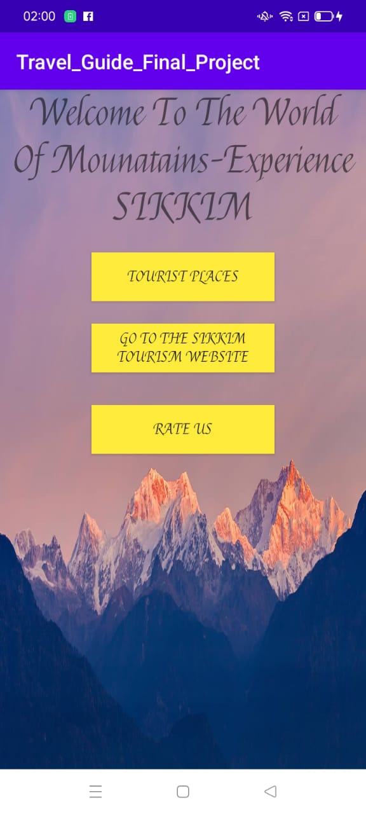
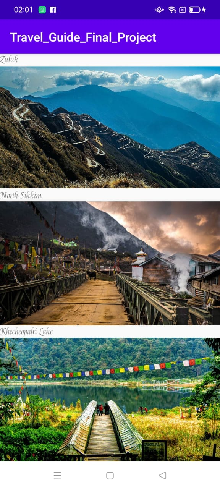
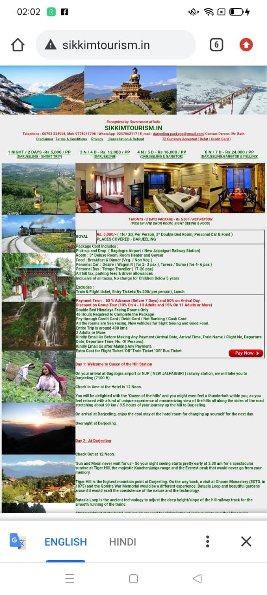
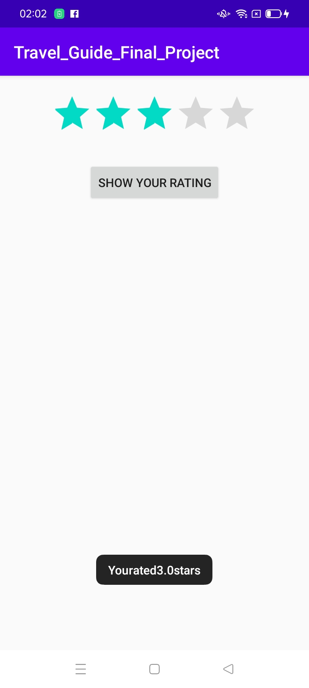

# Tourism App
The aim of the project was to design an application that provides tourist with basic information on places of interest in Sikkim.

Its a basic app with 3 buttons on home page,one takes you to the famous tourist places in Sikkim,the second one re-directs you to the official Sikkim Govt. Tourist Website,and the third one where you can rate the app on a 5-scale rating.

|  |  |  |  |

## Built With
* [Android](https://developer.android.com/studio/index.html)
* [Java](https://java.com/en/) 
